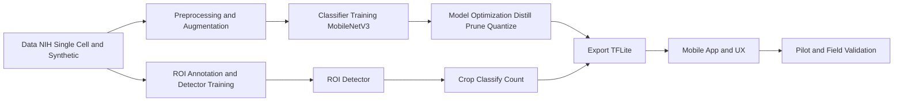
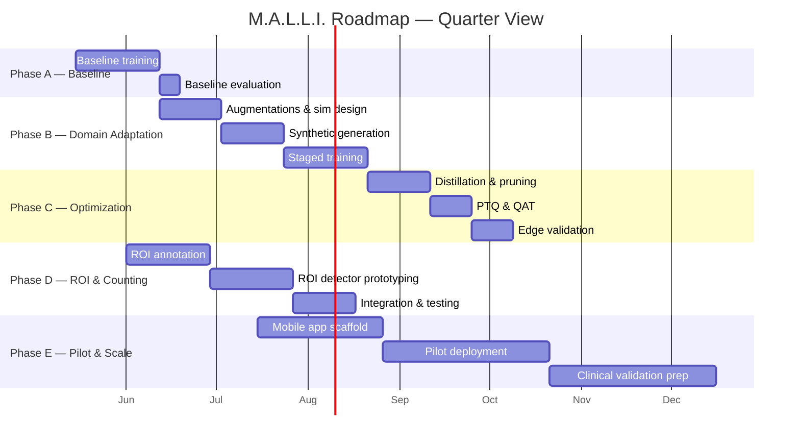

# M.A.L.L.I. — Professional Roadmap

## Executive Summary
This document is the authoritative project roadmap for M.A.L.L.I. (Mobile Advanced Lightweight Localization & Imaging). It organizes work into strategic phases, milestones, success criteria, timelines, risks, and ownership. The goal is to deliver an offline-capable mobile diagnostic pipeline that detects and counts parasitized red blood cells from low-cost optics on low-end smartphones.

Key outcomes:
- Robust single-cell classifier that generalizes to field conditions.
- Lightweight ROI detector and counting pipeline for whole-smear analysis.
- Production-ready TFLite model optimized for very low-end Android devices.

---

## Project Hierarchy
- Strategy (Vision & KPI targets)
- Program (Phases: Baseline → Domain Adaptation → Optimization → Pilot → Scale)
- Projects (Training, ROI Detection, Mobile App, Data Ops)
- Tasks (milestones and actionable work)

---

## Deep Dive Library

Use these documents when you need implementation detail beyond the roadmap summary. The index lives in [docs/deep_dive/README.md](docs/deep_dive/README.md).

| Roadmap Area | Deep Dive Document | Purpose |
| --- | --- | --- |
| Dataset ingestion and storage | [Dataset Ingestion & Storage Deep Dive](docs/deep_dive/Dataset_Ingestion_Storage_DeepDive.md) | Raw dataset staging, manifests, SSD layout, splits, and QC |
| Smear interpretation | [Smear Analysis Deep Dive](docs/deep_dive/Smear_Analysis_DeepDive.md) | Thin vs thick smear handling and scene understanding |
| ROI detection and counting | [ROI Detection, Sectioning & Counting Deep Dive](docs/deep_dive/ROI_Sectioning_Counting_DeepDive.md) | Candidate generation, sectioning, deduplication, and parasitemia |
| Evaluation and calibration | [Evaluation, QC & Calibration Deep Dive](docs/deep_dive/Evaluation_QC_Calibration_DeepDive.md) | Metrics, thresholds, uncertainty, and failure analysis |
| Mobile optimization | [Mobile Optimization Deep Dive](docs/deep_dive/Mobile_Optimization_DeepDive.md) | Distillation, pruning, quantization, and runtime profiling |
| Phone integration | [Phone Integration Deep Dive](docs/deep_dive/Phone_Integration_DeepDive.md) | On-device ML pipeline, camera flow, UI, and storage |
| Blood smear overall plan | [Blood Smear Deep Dive](docs/deep_dive/BloodSmear_DeepDive.md) | End-to-end technical framing for the blood-smear program |

---

## Mermaid Overview Diagrams

Flow of major components:



High-level schedule (Gantt):



---

## Phases, Projects, and Deliverables (Detailed)

1) Baseline — Single-cell classification
- Objective: Reliable classifier on NIH single-cell images.
- Key artifacts: reproducible training script, baseline weights, per-stage CSV logs.
- Acceptance: validation AUC ≥ 0.90 on NIH holdout; reproducible run via `python train.py`.
- Primary files: [train.py](train.py#L1), [data/data_loader.py](data/data_loader.py#L1), [models/model_factory.py](models/model_factory.py#L1).

2) Domain Adaptation — Synthetic & Optical realism
- Objective: Simulate field optics and smear density; train robust models.
- Key artifacts: augmentation library, synthetic dataset pipeline (`synthetic_field_ready/labels.csv`), staged training logs.
- Acceptance: model maintains AUC ≥ 0.85 on field-augmented holdout and shows increased robustness vs baseline.

3) Optimization — Edge-ready models
- Objective: Reduce model size and latency while preserving accuracy.
- Techniques: knowledge distillation, structured pruning, PTQ, optional QAT.
- Acceptance: TFLite INT8 model <5 MB, latency targets met on a reference device, ≤2% accuracy degradation.

4) ROI Detection & Counting
- Objective: Detect cell ROIs in whole-smear images and apply classifier to count parasitized cells.
- Key artifacts: annotated ROI dataset (COCO/CSV), detector model, end-to-end evaluation scripts.
- Acceptance: ROI recall >95% (IoU 0.3), per-smear parasitized % RMSE <5%.

5) Mobile App & Pilot
- Objective: Deploy offline-capable app, run pilot studies, collect field feedback and data.
- Key artifacts: Android/iOS apps, pilot data, issue tracker and telemetry.
- Acceptance: Pilot achieves sensitivity & specificity targets (>90%), good UX feedback.

---

## Success Metrics (KPIs)
- Model: AUC, sensitivity, specificity, F1, per-smear percent error.
- System: avg latency per ROI, memory footprint, APK size, battery impact.
- Field: pilot sensitivity/specificity, user SUS score, time-to-result.

---

## Risks & Mitigations
- Data mismatch (risk): Acquire small real Foldscope dataset early; tune augmentations.
- Class imbalance (risk): Use sample weighting, focal loss as needed.
- Mobile performance (risk): Plan for progressive optimization (distillation → pruning → PTQ).

---

## Roles & Ownership (Suggested)
- Research/Modeling: training scripts, augmentations, evaluation — Owner: ML Engineer
- Data Ops: synthetic pipeline, ROI annotation, dataset curation — Owner: Data Engineer
- Mobile & UX: app scaffold, camera & inference integration — Owner: Mobile Engineer
- Field Ops: pilot coordination, data collection, clinical liaison — Owner: Project Lead

---

## Reference Commands & Quick Checks
- Run a short local sanity run (1 epoch):

```bash
python train.py --launch-dashboard
```

- Validate dataset yields (example snippet):

```python
from data.data_loader import MalariaDataset
ds = MalariaDataset('nih_data', batch_size=8)
train, val = ds.create_datasets()
batch = next(iter(train))  # expect (images, labels, sample_weights)
print(batch[0].shape, batch[1].shape)
```

---

## Next Actions (short-term)
1. Run Milestone 1 sanity run and capture first-epoch logs and CSVs.
2. Start ROI annotation (50 images) and share COCO/CSV sample.
3. Use the deep-dive library above as the reference path for implementation work in each phase.

---

If you want, I can now:
- (A) Run the quick sanity training pass and return logs (CSV + TensorBoard snapshot), or
- (B) Commit a `roadmap_tasks.md` and a `docs/diagrams/` mermaid files and render images for review.

Tell me which and I'll start immediately.