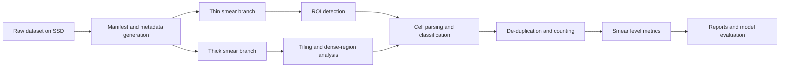
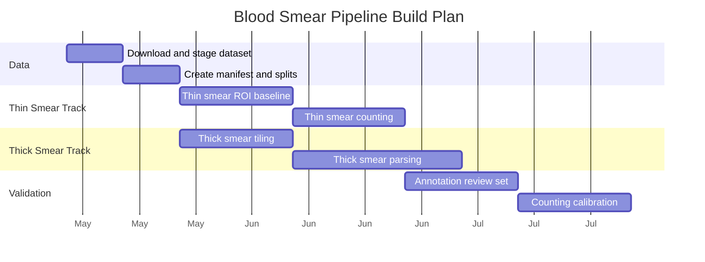

# Blood Smear Deep Dive

## Purpose
This document is the technical deep dive for bringing the Harvard Dataverse blood-smear dataset into M.A.L.L.I. and turning it into an end-to-end pipeline for:

- ingesting large blood-smear datasets safely and reproducibly
- separating thin-smear and thick-smear workflows
- detecting regions of interest (ROIs)
- parsing cells individually from crowded regions
- counting total cells and parasitized cells per sample
- preparing the system for eventual mobile deployment

This doc complements the broader roadmap in [docs/Roadmap.md](docs/Roadmap.md).

---

## 1. Dataset Context

The Dataverse dataset at https://dataverse.harvard.edu/dataset.xhtml?persistentId=doi:10.7910/DVN/O2WVWA is large enough that it should be treated like a production data asset, not a convenience download.

### What makes it different
- The archive is large enough to stress local storage and extraction.
- The content is likely more realistic than a toy cell dataset.
- The dataset supports multiple downstream tasks, not just classification.
- The same image may contribute to detection, segmentation, and counting, so leakage control matters.

### Why it matters for M.A.L.L.I.
The current M.A.L.L.I. pipeline is strongest at single-cell classification. This dataset is the bridge from "cell-level classifier" to "smear-level analysis system".

---

## 2. Project Goal

The final system should answer questions like:

- How many cells are present in this smear?
- How many are parasitized?
- What percentage of cells are parasitized?
- Is the sample thin smear or thick smear?
- Where are the suspicious regions of the image?
- How confident is the model in the count?

This shifts the project from simple image classification to a full analytical pipeline.

---

## 3. Recommended End-to-End Architecture



### Reading the diagram
- **Raw dataset on SSD:** the original archive and extracted images live outside the repository.
- **Manifest generation:** every file gets metadata before training or annotation starts.
- **Thin smear branch:** prioritizes individual cell detection and classification.
- **Thick smear branch:** prioritizes tiling, dense clustering, and segmentation.
- **Cell parsing and classification:** the common step where a candidate cell is judged parasitized or not.
- **De-duplication and counting:** avoids counting the same cell more than once when tiles overlap.
- **Smear-level metrics:** the final output for clinical usefulness.

---

## 4. Storage and Ingestion Plan

### 4.1 Storage strategy
Because the dataset is large, the best practice is:
- store the raw zip on an external SSD
- extract into a stable dataset root on that SSD
- keep annotations and manifests in the repo
- keep derived crops, tiles, and caches in a separate generated-data folder

### 4.2 Suggested directory layout
```text
data/
  raw/
    dataverse/
      archive.zip
      extracted/
  interim/
    tiles/
    crops/
    qc/
  processed/
    thin/
    thick/
    roi/
  annotations/
    coco/
    csv/
    review/
  manifests/
    files.csv
    slides.csv
    splits.csv
```

### 4.3 Ingestion rules
- Never split by crop before creating the manifest.
- Split by slide, patient, or acquisition group when available.
- Keep the original file path in every manifest row.
- Add a checksum column if possible.
- Record whether the image is thin smear, thick smear, or unknown.

### 4.4 Manifest fields
Recommended minimum columns:
- `sample_id`
- `file_path`
- `source`
- `smear_type`
- `patient_id` or `slide_id`
- `label`
- `roi_count`
- `annotation_state`
- `split`
- `notes`

---

## 5. Thin Smear vs Thick Smear

The dataset should be split into two operational tracks.

### 5.1 Thin smear track
Thin smears are the best place to start because they are closer to a one-cell-per-ROI problem.

Typical goal:
- isolate one cell per region
- classify each cell as parasitized or uninfected
- count all detected cells

Thin smears are ideal for:
- ROI detector baselines
- cell classification experiments
- counting validation

### 5.2 Thick smear track
Thick smears are harder because the cells are denser and more overlapping.

Typical goal:
- detect dense cell clusters
- separate touching cells
- estimate counts robustly even when boundaries are ambiguous

Thick smears are ideal for:
- tiling experiments
- segmentation and watershed approaches
- dense-scene counting

### 5.3 Why the split matters
If thin and thick images are mixed too early, the model may learn shortcuts and underperform on the hard cases. Treat them as two related but distinct problem families.

---

## 6. ROI Detection Strategy

ROI detection is the bridge between a whole smear and a cell-level classifier.

### 6.1 What counts as an ROI
An ROI can be:
- a single red blood cell
- a cluster of touching cells
- a parasite-containing region
- a dense tile from a thick smear

### 6.2 Two-stage ROI strategy
#### Stage 1: fast candidate generation
- classical thresholding
- contour detection
- blob detection
- tile scoring for large smear images

#### Stage 2: learned refinement
- lightweight object detector
- classification of candidate regions
- rejection of false positives

### 6.3 Candidate ROI types
- **Cell ROI:** tightly cropped individual cell
- **Cluster ROI:** a group of overlapping cells
- **Field ROI:** a larger tile containing several candidate cells
- **Uncertain ROI:** ambiguous region that may need human review

### 6.4 Detector targets
A practical first detector can predict:
- bounding box
- confidence score
- class: cell / cluster / background

Later versions can add:
- parasitized / uninfected class
- cell size estimate
- quality score

---

## 7. Cell Sectioning and Parsing

Once ROIs are detected, the system needs to separate individual cells as much as possible.

### 7.1 Sectioning modes
#### Thin smear sectioning
- one ROI should usually map to one cell
- use tighter crops and deduplication
- count each unique cell once

#### Thick smear sectioning
- use overlapping tiles
- identify clusters and split them when possible
- apply segmentation or watershed-style separation when cells touch

### 7.2 Practical parsing methods
#### Classical methods
- thresholding
- morphology cleanup
- distance transform
- watershed segmentation

#### Learned methods
- detector with small anchor boxes
- semantic segmentation for dense regions
- instance segmentation if annotation quality supports it

### 7.3 Recommended first implementation
Start with:
- tile-based detection
- non-max suppression
- simple morphology-based splitting for touching cells

Then graduate to:
- lightweight segmentation model
- instance-aware counting

---

## 8. Counting Logic

Counting should happen after duplicate removal.

### 8.1 Core counts
- total candidate cells
- confirmed cells
- parasitized cells
- uncertain cells
- rejected false positives

### 8.2 Counting formula
For a smear-level result:
$$
\text{parasitemia} = \frac{\text{parasitized cells}}{\text{total confirmed cells}} \times 100
$$

### 8.3 De-duplication rules
Use de-duplication because the same cell may appear in overlapping tiles.

Recommended methods:
- non-max suppression on overlapping boxes
- centroid clustering for repeated detections
- confidence-based tie-breaking

### 8.4 Quality checks
A count should be flagged if:
- too many overlapping detections remain
- the smear has too few detected cells for the field size
- the classifier confidence is unstable
- the ROI coverage is poor

---

## 9. Annotation Plan

A good annotation plan will save a lot of time later.

### 9.1 Annotation layers
1. **Image-level labels**
   - thin smear
   - thick smear
   - parasitized / uninfected / mixed / unknown

2. **ROI labels**
   - cell bounding boxes
   - cluster bounding boxes
   - smear field boxes

3. **Cell labels**
   - parasitized
   - uninfected
   - ambiguous

4. **Review labels**
   - needs manual review
   - low confidence
   - occluded
   - out of focus

### 9.2 Annotation tools
Good candidates:
- CVAT
- LabelImg
- Label Studio

### 9.3 Annotation policy
- Annotate a small gold-standard set first.
- Define what counts as one cell vs one cluster.
- Document edge cases.
- Keep annotation decisions consistent across annotators.

---

## 10. Metrics and Validation

This project should not rely on one metric alone.

### 10.1 Detection metrics
- precision
- recall
- F1
- IoU
- false positive rate

### 10.2 Counting metrics
- absolute count error
- mean absolute error
- percent error
- correlation with manual counts

### 10.3 Diagnostic metrics
- parasitemia percentage error
- sensitivity for parasitized cells
- specificity for uninfected cells
- confidence calibration

### 10.4 Field quality metrics
- focus quality
- contrast quality
- ROI coverage
- runtime on device

---

## 11. Recommended Development Sequence



### Sequence rationale
- first stabilize ingestion and metadata
- then build thin-smear ROI logic
- then add thick-smear complexity
- finally unify everything into smear-level counting

---

## 12. Risks and Mitigations

### Risk: dataset too large for normal working storage
Mitigation:
- use SSD storage
- avoid duplicate extracted copies
- stream or stage derived data only when needed

### Risk: too much complexity too early
Mitigation:
- start with thin smears
- build a simple ROI baseline before deep learning segmentation
- separate detection from counting

### Risk: counting bias from overlapping crops
Mitigation:
- use overlap-aware de-duplication
- evaluate with slide-level counts, not just crop-level metrics

### Risk: weak annotations
Mitigation:
- create a small high-quality reference set
- define ROI and cell boundaries precisely
- review ambiguous cases consistently

---

## 13. Implementation Mapping to M.A.L.L.I.

This deep-dive roadmap maps directly to the current project layers:

- `train.py`: staged training and export
- `data/data_loader.py`: NIH single-cell ingestion and augmentation
- `data/synthetic_data_loader.py`: synthetic mixture training
- future ROI module: dataset tiling, detection, and counting
- future mobile app: on-device inference and capture UX

The broader project roadmap lives in [docs/Roadmap.md](docs/Roadmap.md).

---

## 14. Immediate Next Steps

1. Move or mount the Dataverse dataset onto the SSD.
2. Create the manifest CSV and the split definitions.
3. Tag a small set of images as thin or thick smear.
4. Build a first ROI baseline on thin smears.
5. Add counting and parasitemia calculation on top of the ROI output.
6. Only after that, expand toward full mobile optimization.

---

## 15. Decision Tree for the First Build

- If the image is mostly isolated cells, use the thin-smear branch.
- If the image is dense and overlapping, use the thick-smear branch.
- If the image is unclear, tile first and defer uncertain ROIs to review.
- If the same cell appears in multiple crops, de-duplicate before counting.
- If count quality is low, flag the smear for manual review.

---

## 16. Bottom Line

The Dataverse dataset is not just "more data". It is the data asset that lets M.A.L.L.I. evolve from a binary classifier into a clinically useful analysis pipeline. The project should be framed around three layers:

1. cell classification
2. ROI detection and parsing
3. smear-level counting and reporting

That framing keeps the work organized, scalable, and aligned with the end goal of accessible malaria diagnostics.
