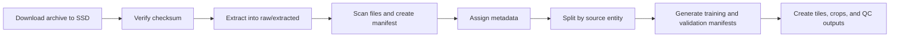

# Dataset Ingestion & Storage Deep Dive

## Purpose
This document defines how the blood-smear dataset should be brought into the project, structured on disk, versioned, split safely, and prepared for downstream training, annotation, and evaluation.

It is the operational companion to [docs/BloodSmear_DeepDive.md](BloodSmear_DeepDive.md) and the storage-related sections of [docs/Roadmap.md](../Roadmap.md).

---

## 1. Why this layer matters

The dataset is the foundation of everything else. If ingestion is weak, every downstream result becomes harder to trust.

The ingestion layer must:
- keep raw data immutable
- prevent train/validation leakage
- record provenance
- support thin and thick smear branches
- allow derived crops and tiles without overwriting source data
- stay workable on a Windows machine with limited local SSD capacity

---

## 2. Operating principles

1. **Raw data stays raw.**
   Never edit or overwrite original images.

2. **Derived data is disposable.**
   Tiles, crops, caches, and temporary exports should be regenerable.

3. **Splits happen on source entities.**
   Split by slide, patient, or acquisition group, not by tile.

4. **Manifests are the source of truth.**
   Every sample should be traceable from a CSV or JSON manifest.

5. **Storage is tiered.**
   Raw on SSD, processed in working space, annotations in repo.

---

## 3. Recommended disk layout

```text
datasets/
  blood_smear/
    raw/
      dataverse_zip/
      extracted/
    manifests/
      files.csv
      slides.csv
      splits.csv
    interim/
      tiles/
      crops/
      qc/
    processed/
      thin/
      thick/
      roi/
    annotations/
      coco/
      csv/
      review/
    exports/
      reports/
      figures/
```

### Suggested rule of thumb
- `raw/` = read-only source content
- `interim/` = temporary or regenerable artifacts
- `processed/` = curated inputs for training and evaluation
- `annotations/` = human labels and corrections
- `exports/` = reports, summaries, and deliverables

---

## 4. Ingestion workflow



### Step-by-step

#### Step 1: download
- save the archive to the SSD, not the repo
- keep the original archive name and download record
- record the source URL and download date

#### Step 1b: cache
- convert the archive into compressed TFRecord shards once
- keep the ZIP as the raw source of truth, but do not reopen it during routine training
- write the cache under a dedicated processed directory such as `datasets/blood_smear/processed/tfrecord/`

#### Step 2: verify
- compute checksum if possible
- confirm the archive opens cleanly
- log extraction errors separately from image errors

#### Step 3: extract
- extract into a dedicated raw folder
- preserve folder names and source hierarchy
- avoid nesting multiple duplicate extractions

#### Step 4: scan
- enumerate image files
- capture size, extension, and directory path
- flag broken or unreadable files

#### Step 4b: shard
- build stratified train and validation shards
- store image bytes, labels, and sample weights inside TFRecord examples
- keep the shard count small enough for parallel reads, but large enough to avoid giant monolith files

#### Step 5: enrich metadata
Add fields such as:
- smear type
- source slide or case ID
- label if available
- quality flags
- annotation state
- split assignment

#### Step 6: split safely
- keep any related images in the same split
- do not split crops from the same source image across train and validation
- use stratification only after source grouping is defined

---

## 5. Manifest design

A single manifest row should represent one image or tile.

Recommended columns:
- `sample_id`
- `source_path`
- `relative_path`
- `smear_type`
- `source_group`
- `label`
- `is_roi`
- `annotation_state`
- `split`
- `width`
- `height`
- `checksum`
- `notes`

### Example manifest semantics
- `source_group` keeps all related derivatives together.
- `split` should be assigned to the group, not each crop independently.
- `annotation_state` can be `none`, `partial`, `complete`, or `review`.

---

## 6. Thin and thick track assignment

### Thin smear assets
- mostly isolated cells
- easier to classify and count
- better for classifier and ROI detector baselines

### Thick smear assets
- dense regions
- overlapping cells
- better for tiling, segmentation, and density estimation

### Assignment logic
- if a smear has clear, separated cells, route to the thin track
- if cell overlap is heavy, route to the thick track
- if uncertain, mark as mixed or review

---

## 7. Data quality and QC checks

### File-level checks
- file is readable
- image dimensions are valid
- image channels are correct
- image is not empty or corrupted

### Manifest-level checks
- no duplicate IDs
- no missing source paths
- no split leakage
- all source groups have one consistent split

### Visual QC checks
- a random sample of extracted tiles looks correct
- crops are centered where expected
- no accidental double extraction or folder confusion

---

## 8. Storage sizing and SSD planning

### Why SSD matters
The dataset is too large and too active for comfortable handling on a crowded system disk.

### Suggested SSD strategy
- dedicate one SSD folder for raw data
- dedicate another for derived outputs
- avoid storing long-lived caches in the repo workspace
- clean up temporary tiles after exports or re-create them when needed

### Practical policy
- raw source: keep forever
- annotations: keep under version control or backed up
- TFRecord caches: keep while the archive is actively used; rebuild only when the source changes
- generated tiles: keep only while experiments are active
- exports: keep only final reports and selected examples

---

## 9. Downstream handoff contract

The ingestion layer should produce the following artifacts for downstream modules:

- manifests for training
- manifests for validation and test
- tile lists for ROI detection
- annotation-ready image sets
- QC reports for failed files
- source maps from crop back to original smear

This makes the rest of the pipeline much easier to debug.

---

## 10. Integration points in the repo

Relevant current files:
- [train.py](../../train.py)
- [data/data_loader.py](../../data/data_loader.py)
- [data/synthetic_data_loader.py](../../data/synthetic_data_loader.py)

Future additions should likely live under:
- `data/ingestion/`
- `data/manifests/`
- `data/qc/`

---

## 11. Immediate next steps

1. Define the final SSD folder path.
2. Create the first manifest from the extracted archive.
3. Add source grouping and split assignment.
4. Build a small QC script that validates file integrity.
5. Decide whether the initial split is by patient, slide, or acquisition batch.

---

## 12. Bottom line

A disciplined ingestion layer is the difference between a research folder and a serious diagnostic pipeline. This step should be treated as infrastructure, not as a one-time download task.
