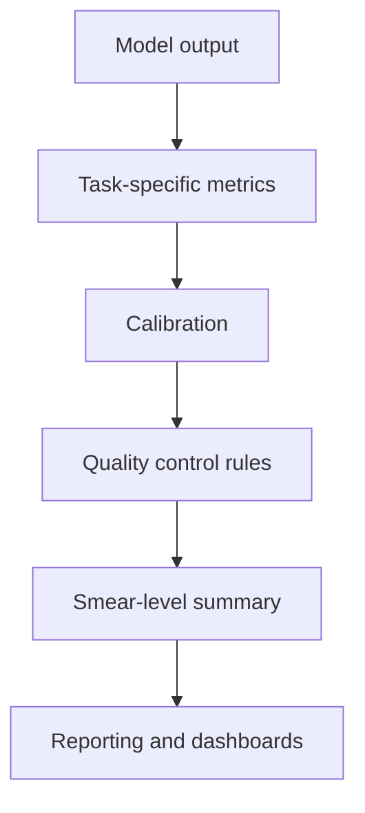

# Evaluation, QC & Calibration Deep Dive

## Purpose
This document defines how M.A.L.L.I. should be evaluated and calibrated across classification, detection, counting, and mobile deployment.

A strong project needs more than training accuracy. It needs:
- reliable validation
- measurable uncertainty
- quality control
- calibration for decision thresholds
- repeatable reporting

---

## 1. Why evaluation needs its own layer

The project has multiple outputs:
- cell classification
- ROI detection
- sectioning quality
- smear counts
- parasitemia percentage
- on-device runtime

Each one needs its own metrics. If everything is evaluated with a single score, the system can look good while still failing in practice.

---

## 2. Evaluation stack

---

## 3. Metric layers

### Classification metrics
- accuracy
- precision
- recall
- F1
- AUC
- calibration error

### Detection metrics
- precision
- recall
- IoU
- mean average precision where relevant

### Counting metrics
- absolute error
- mean absolute error
- percentage error
- correlation with manual counts

### Operational metrics
- latency
- peak memory
- battery use
- failure rate

---

## 4. Validation design

### Split strategy
Validate by source group, not by crop.

### Reasons
- crops from the same smear are highly correlated
- leakage causes inflated scores
- smear-level performance is what matters in practice

### Recommended splits
- train
- validation
- test
- optional field set

---

## 5. Calibration

A model can be accurate but poorly calibrated.

### Why calibration matters
- thresholds determine what is called parasitized
- confidence scores affect user trust
- uncertain outputs should be handled differently from confident ones

### Calibration outputs
- threshold
- confidence distribution
- expected reliability curves
- uncertainty flagging rules

### Practical approach
- calibrate classification thresholds on validation data
- tune decision thresholds for recall if clinical use favors sensitivity
- keep separate thresholds for detection and final report generation

---

## 6. Quality control policy

### QC states
- pass
- review
- reject

### QC triggers
- blurry input
- too few detected cells
- extreme duplicate rate
- inconsistent counts across tiles
- suspiciously low confidence

### QC philosophy
The system should avoid making a strong claim when the input does not support one.

---

## 7. Smear-level evaluation

Smear-level reporting should compare predictions to manual reference counts.

### Key smear-level metrics
- total cell count error
- parasitized cell count error
- parasitemia error
- overcount rate
- undercount rate

### Useful derived measures
- relative error
- confidence intervals
- per-smear quality score

---

## 8. Confidence intervals and uncertainty

Count outputs should ideally include uncertainty bounds.

Examples:
- bootstrap confidence intervals
- tile-consistency estimates
- classifier probability dispersion

### Why this matters
A smear with a 12% parasitemia estimate and a wide uncertainty interval should not be treated the same as a smear with a tight confidence band.

---

## 9. Dashboard outputs

The evaluation dashboard should show:
- training and validation curves
- threshold calibration plots
- confusion matrices
- smear-level count histograms
- false positive / false negative examples
- QC failure examples

---

## 10. Reporting format

A per-smear report should include:
- file or sample ID
- smear type
- final count
- parasitized count
- parasitemia percentage
- confidence / QC flag
- model version
- preprocessing version
- timestamp

---

## 11. Mobile evaluation

When the system runs on phone, evaluation should include:
- inference time per image or tile
- memory usage
- thermal stability
- battery impact
- success rate under difficult imaging conditions

### Mobile validation device set
Use at least:
- one older low-end device
- one mid-range device
- one reference device for comparison

---

## 12. Calibration workflow

1. run model on validation data
2. collect probabilities and counts
3. sweep thresholds
4. choose operating point
5. confirm smear-level behavior
6. lock thresholds for the current model version

---

## 13. Failure analysis

Every evaluation cycle should inspect mistakes.

### Useful failure buckets
- false parasitized cell
- missed parasitized cell
- merged cells counted as one
- duplicate detection from overlapping tiles
- background artifact counted as cell
- low-quality input that should have been rejected

### Why failure analysis matters
It identifies whether the fix should be in the model, the data, the preprocessing, or the QC policy.

---

## 14. Repo integration points

Current relevant files:
- [train.py](../../train.py)
- [models/model_factory.py](../../models/model_factory.py)
- [utils/dashboard.py](../../utils/dashboard.py)

Future additions:
- `evaluation/metrics.py`
- `evaluation/calibration.py`
- `evaluation/reporting.py`
- `evaluation/failure_analysis.py`

---

## 15. Immediate next steps

1. define the final metric set for smear-level evaluation
2. add threshold calibration to the training pipeline
3. create a report template for per-smear results
4. build a QC decision table
5. set up failure bucket labels for analysis

---

## 16. Bottom line

Evaluation is not just the last step in the pipeline. It is the mechanism that tells the rest of the project whether it should trust its own outputs.
