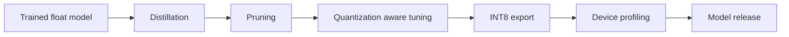

# Mobile Optimization Deep Dive

## Purpose
This document explains how to shrink, accelerate, and validate M.A.L.L.I. models for very low-end mobile devices without losing too much accuracy.

It covers:
- distillation
- pruning
- quantization
- delegate selection
- runtime profiling
- deployment checks

---

## 1. Why optimization needs its own deep dive

A model that works on a workstation may fail on a phone because of:
- size
- memory pressure
- latency
- thermal throttling
- unsupported ops
- poor preprocessing parity

Optimization is a product problem as much as a model problem.

---

## 2. Optimization pipeline

---

## 3. Distillation

### Goal
Transfer knowledge from a stronger model into a smaller model.

### Why it helps
The smaller model can learn smoother decision boundaries and retain more accuracy than training from scratch.

### Distillation ingredients
- teacher model
- student model
- soft targets
- temperature scaling
- weighted classification loss

### Practical approach
- start from a strong floating-point teacher
- make the student narrower or shallower
- tune loss weighting to preserve recall on parasitized cells

---

## 4. Pruning

### Goal
Remove unnecessary weights or filters.

### Types
- structured pruning
- unstructured pruning

### Practical recommendation
For mobile deployment, structured pruning is often easier to benefit from because it aligns better with real runtime speedups.

### Fine-tuning after pruning
Pruning should almost always be followed by recovery training.

---

## 5. Quantization

### Goal
Convert the model to a smaller, faster numeric representation.

### Preferred target
INT8 TFLite for the mobile release path.

### Why INT8 matters
- smaller model size
- faster CPU inference
- better compatibility with mobile delegates

### Risks
- accuracy drop
- preprocessing mismatch
- unsupported operators

### Best practice
Use representative calibration data and verify outputs before release.

---

## 6. Quantization-aware training

If post-training quantization causes too much accuracy loss, use QAT.

### QAT benefits
- simulates quantization during training
- helps preserve accuracy
- often gives a better final mobile model

### When to use it
- after a strong float model is ready
- after pruning has stabilized
- when PTQ accuracy is not enough

---

## 7. Runtime optimization

### Common runtime actions
- resize input dimensions if acceptable
- batch only when useful
- cache model interpreter and tensors
- avoid repeated allocations
- reuse buffers where possible

### Device delegates
Possible runtime accelerators:
- CPU fallback
- GPU delegate
- Android NNAPI

The app must remain usable even when acceleration is unavailable.

---

## 8. Profiling targets

The release candidate should be measured for:
- model size
- peak memory
- warm-up time
- per-image latency
- per-smear latency
- thermal stability
- battery impact

### Why profiling matters
A model can be technically correct yet unusable if it overheats the phone or drains the battery too quickly.

---

## 9. Mobile-specific model design

### Good mobile choices
- MobileNet-style backbones
- small input sizes where acceptable
- lightweight heads
- simple output formats

### Avoid where possible
- very large backbones
- excessive branching
- heavy postprocessing on device
- expensive segmentation unless needed

---

## 10. Release stages

### Stage 1: research model
- float model
- maximum accuracy
- training and validation on workstation

### Stage 2: mobile candidate
- distilled and pruned
- still float or mixed precision
- run in test app

### Stage 3: quantized release candidate
- INT8 export
- device verification
- threshold calibration

### Stage 4: production candidate
- tested on real phones
- monitored across edge cases
- packaged with version metadata

---

## 11. Integration with the current repo

Current file mapping:
- [train.py](../../train.py) handles staged training and export
- [models/model_factory.py](../../models/model_factory.py) handles the classifier and compile settings
- [models/export_tflite.py](../../models/export_tflite.py) can be used or extended for release export
- [models/inference.py](../../models/inference.py) should likely host mobile-friendly inference logic

---

## 12. Mobile release checklist

Before releasing a model to the phone app:
- verify identical preprocessing
- verify labels and thresholds
- verify model loading on device
- verify runtime on at least one low-end phone
- verify fallback behavior if a delegate fails
- verify outputs on a golden test set

---

## 13. Immediate next steps

1. establish a baseline mobile benchmark.
2. pick the first quantized model target.
3. define the acceptable accuracy drop.
4. test preprocessing parity end to end.
5. profile the app on a low-end device.

---

## 14. Bottom line

Optimization is not just model compression. It is the discipline of making the model trustworthy, fast, and stable on the exact devices the project is meant to serve.
