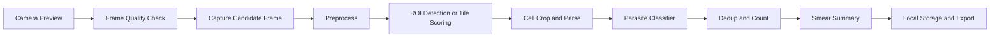
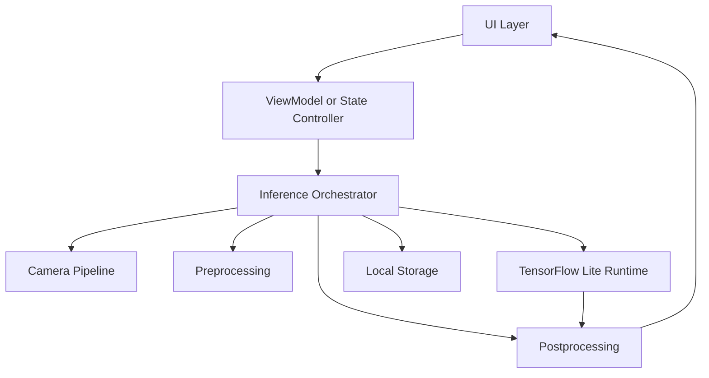
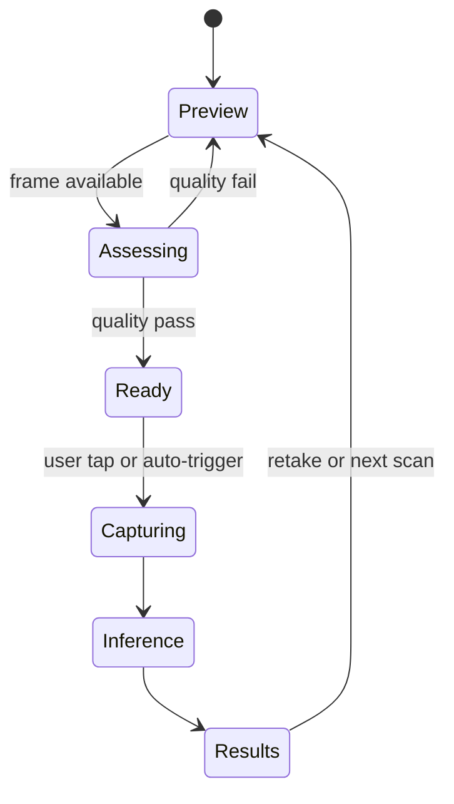
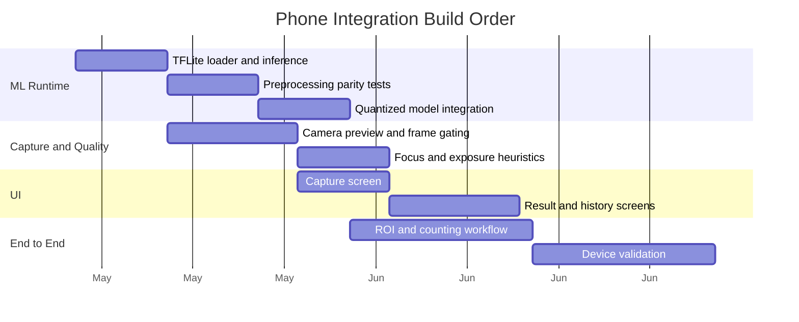

# Phone Integration Deep Dive

## Purpose
This document explains how M.A.L.L.I. should run on a phone end-to-end, both from the on-device machine learning side and from the user interface side.

The goal is to make the app:
- fast enough for low-end phones
- simple enough for field use
- robust enough to work offline
- structured enough to support ROI detection, cell counting, and smear-level reporting

This document covers:
- on-phone ML architecture
- camera and inference pipeline
- UI/UX architecture
- app state and usage flow
- performance and memory constraints
- code structure and implementation guidance
- deployment and testing strategy

It is intended to stand alongside [docs/Roadmap.md](docs/Roadmap.md) and [docs/BloodSmear_DeepDive.md](docs/BloodSmear_DeepDive.md).

---

## 1. Product Goal on Mobile

The mobile product should answer a practical question in the field:

> Is this smear parasitized, and how many parasitized cells are present?

That means the app should do more than classify a single image. It should support:
- image capture
- focus guidance
- smear quality checks
- cell ROI detection
- cell parsing and classification
- cell counting and parasitemia estimation
- local result storage
- review and correction by the user

### Mobile success criteria
A good mobile system should:
- run fully offline after installation
- work on older Android phones with limited RAM
- keep inference latency low
- remain usable in bright, difficult field conditions
- provide a clear final result without requiring ML expertise from the user

---

## 2. Phone-Side ML Architecture

### 2.1 Overall on-device ML pipeline



### 2.2 Core ML stages on phone

#### Stage 1: frame quality gating
Before inference, the app should reject poor frames.

Checks:
- blur / focus score
- brightness / exposure score
- motion stability
- lens alignment / centering

Purpose:
- avoid wasting inference cycles
- reduce false positives from unusable images
- guide the user to recapture when necessary

#### Stage 2: ROI detection or tile scoring
The first model or algorithm identifies candidate smear regions.

Possible approaches:
- lightweight object detector
- tile classifier for large smear images
- hybrid classical + learned pipeline

Recommended first release:
- tile the image
- score tiles with a lightweight model
- only run cell parsing on high-score tiles

#### Stage 3: cell parsing and classification
Each candidate ROI is converted into a cell-level decision.

Outputs:
- infected
- uninfected
- uncertain

This should be the same classifier family already used in the project, but compressed for mobile.

#### Stage 4: de-duplication and counting
Because mobile inference may use overlapping tiles, detections must be merged.

Methods:
- non-max suppression
- centroid clustering
- confidence-weighted merge
- tile boundary reconciliation

#### Stage 5: smear summary
The final result should be presented as:
- total cells counted
- parasitized cells counted
- parasitemia percentage
- confidence / quality flag
- optional annotated image overlay

---

## 3. Deployment Model Choices

### 3.1 Recommended model format
The default mobile model should be TensorFlow Lite INT8.

Why:
- small footprint
- fast CPU inference
- broad Android support
- optional hardware delegate support

### 3.2 Suggested model strategy
A practical hierarchy is:
1. floating-point training model
2. distilled smaller model
3. pruned mobile model
4. INT8 quantized export
5. optional quantization-aware fine-tuning

### 3.3 What should run on-device
Run on-device:
- frame gating
- ROI detection
- cell classification
- counting
- confidence scoring
- local storage

Avoid on-device if possible:
- heavy retraining
- large-scale analytics
- cloud-dependent post-processing

### 3.4 Hardware delegates
Support delegates where available:
- Android NNAPI
- GPU delegate
- CPU fallback

A low-end phone should still work with CPU fallback even if delegate acceleration is unavailable.

---

## 4. Mobile App Architecture

### 4.1 Recommended app layers



### 4.2 Layer responsibilities

#### UI layer
- renders camera view
- shows capture status
- displays focus feedback
- presents result summary
- handles manual review and history

#### ViewModel or state controller
- stores current session state
- receives ML outputs
- converts engine outputs into UI state
- triggers capture and reset actions

#### Inference orchestrator
- coordinates capture, preprocessing, inference, and postprocessing
- ensures one pipeline does not overwrite another
- manages timing and cancellation

#### Camera pipeline
- continuously streams preview frames
- selects frames for capture
- estimates blur and exposure

#### TensorFlow Lite runtime
- loads and runs the model
- handles delegate selection
- manages memory for input/output tensors

#### Postprocessing
- converts model outputs to boxes, counts, and scores
- removes duplicates
- calculates parasitemia

#### Local storage
- saves captures
- saves counts and results
- stores review status and version info

---

## 5. UX and Usage Design

### 5.1 User journey
A field user should be able to:
1. open the app
2. point the camera at the microscope view
3. see focus guidance
4. auto-capture or manually capture
5. receive a simple diagnosis and count summary
6. review the annotated image if needed
7. save or export results

### 5.2 UX principles
- one primary action per screen
- large controls for gloved or fast use
- high-contrast colors
- offline-first behavior
- minimal typing
- clear feedback for bad images

### 5.3 Suggested screens
1. **Home screen**
   - start scan
   - history
   - settings

2. **Capture screen**
   - live preview
   - focus indicator
   - exposure indicator
   - capture button or auto-capture state

3. **Review screen**
   - detection overlays
   - cell count
   - parasitized count
   - parasitemia percentage
   - accept / retake / manual edit

4. **History screen**
   - recent scans
   - search and filter
   - export options

5. **Settings screen**
   - model version
   - delegate selection
   - quality thresholds
   - storage controls

### 5.4 UX error handling
If the input is bad, the app should say what to do next:
- move closer
- improve lighting
- refocus
- clean the lens
- recapture

That is far better than a generic error.

---

## 6. Capture and Quality Gating

A strong mobile app should not run inference on every frame.

### 6.1 Capture strategy
Use a two-step trigger:
- continuous preview monitoring
- capture when the frame meets quality thresholds

### 6.2 Example quality metrics
- blur score from Laplacian variance
- brightness score from mean pixel intensity
- saturation score for stain visibility
- motion score from frame delta or camera instability

### 6.3 Capture state machine



### 6.4 Why this matters
This reduces:
- false captures
- battery drain
- unnecessary model calls
- user frustration

---

## 7. On-Device ML Usage Patterns

### 7.1 Two possible inference modes

#### Mode A: live assist
The app runs a lightweight quality model during preview and only captures when the image is acceptable.

Use this for:
- focus guidance
- quick field checks
- old phones

#### Mode B: post-capture analysis
The app captures one still image, then runs the full ROI and counting pipeline.

Use this for:
- more reliable results
- lower device load
- cleaner smear analysis

### 7.2 Recommended implementation order
Start with Mode B.
It is easier to build, easier to debug, and more reliable on older phones.

Later, add Mode A as a user-experience enhancement.

### 7.3 Performance targets
Suggested initial targets:
- quality gating: under 50 ms per frame
- ROI inference: under 200 ms per crop on low-end CPU
- full smear processing: under a few seconds per scan depending on cell density
- memory usage: keep the app comfortably below device limits

---

## 8. Mobile ML Code Structure

### 8.1 Android-oriented project layout
```text
app/
  src/main/
    java/.../ui/
    java/.../camera/
    java/.../ml/
    java/.../data/
    java/.../storage/
    res/
      layout/
      drawable/
      values/
```

### 8.2 Suggested modules
- `camera`: preview, frame extraction, focus checks
- `ml`: model loading, inference, delegates, preprocessing
- `ui`: screens, widgets, overlays
- `data`: scan metadata, local history, export
- `storage`: files, images, report output

### 8.3 Kotlin-style inference flow
```kotlin
class ScanOrchestrator(
    private val qualityGate: QualityGate,
    private val detector: RoiDetector,
    private val classifier: CellClassifier,
    private val postProcessor: CountPostProcessor,
) {
    suspend fun analyze(frame: Bitmap): ScanResult? {
        if (!qualityGate.isAcceptable(frame)) return null

        val rois = detector.findRegions(frame)
        val predictions = rois.map { roi ->
            val crop = roi.cropFrom(frame)
            classifier.predict(crop)
        }
        return postProcessor.summarize(rois, predictions)
    }
}
```

### 8.4 TensorFlow Lite model loading pattern
```kotlin
class TFLiteCellClassifier(context: Context) {
    private val interpreter = Interpreter(loadModelFile(context, "cell_classifier_int8.tflite"))

    fun predict(input: ByteBuffer): FloatArray {
        val output = FloatArray(1)
        interpreter.run(input, output)
        return output
    }
}
```

### 8.5 Notes on implementation
- keep preprocessing identical to training
- make normalization explicit and testable
- test on representative low-end devices early
- log model version in every scan record

---

## 9. UI Code Structure and Design System

### 9.1 UI architecture
Use a state-driven UI model.

State examples:
- idle
- previewing
- capturing
- analyzing
- showing results
- showing error

### 9.2 UI components
- camera viewport
- focus ring or quality indicator
- capture button
- result cards
- counts panel
- confidence bar
- retake button
- export action

### 9.3 Visual language
- green = acceptable / normal
- amber = caution / uncertain
- red = likely parasitized or error state
- high contrast typography
- large touch targets

### 9.4 UX layout recommendations
- Keep the camera view dominant.
- Avoid hiding the primary action behind menus.
- Use a summary-first result card.
- Keep advanced settings out of the capture flow.

### 9.5 Example UI state model
```kotlin
sealed class ScanUiState {
    data object Idle : ScanUiState()
    data object Previewing : ScanUiState()
    data object Capturing : ScanUiState()
    data object Analyzing : ScanUiState()
    data class Result(val parasitemia: Float, val totalCells: Int) : ScanUiState()
    data class Error(val message: String) : ScanUiState()
}
```

---

## 10. Local Storage and Offline Behavior

### 10.1 What should be stored locally
- scan timestamp
- image path or thumbnail
- prediction result
- counts
- quality score
- model version
- optional user annotations

### 10.2 Why offline matters
The app may be used where:
- connectivity is poor
- data is expensive
- cloud access is not allowed
- battery conservation matters

### 10.3 Storage recommendations
- compress preview captures
- store results in SQLite or a lightweight local database
- allow export only when requested
- clean up old raw captures with user consent

---

## 11. Model Update and Versioning

### 11.1 Versioning strategy
Every scan should record:
- app version
- model version
- preprocessing version
- threshold version

### 11.2 Update strategy
- ship one stable default model
- allow optional download of newer `.tflite` files
- verify checksum before activating a model
- keep rollback support

### 11.3 Why versioning matters
Without versioning, it becomes impossible to explain why two phones produced different outputs from the same image.

---

## 12. Testing Strategy

### 12.1 ML testing
- verify preprocessing parity between training and mobile code
- test quantized model output consistency
- test on a small representative image set
- test accuracy after delegate selection changes

### 12.2 UI testing
- capture flow works without crashes
- result screen renders with no image
- error states are understandable
- history loads correctly

### 12.3 Device testing
Test on:
- one modern mid-range device
- one low-end older Android device
- one constrained-memory scenario

### 12.4 Field testing
- bad lighting
- shaky hands
- off-center capture
- dusty lens
- thick smear and thin smear conditions

---

## 13. Recommended Build Order



### Build order summary
1. get the model running on-device
2. add capture and quality gating
3. build the UI around the pipeline
4. connect ROI detection and counting
5. test on old devices
6. refine for field use

---

## 14. Practical Design Decisions

### Decision 1: start with Android first
Android is the easiest first target for low-end device coverage and more accessible hardware variation.

### Decision 2: use post-capture inference first
This keeps the app simpler and makes debugging easier.

### Decision 3: keep the initial UX simple
Do not overbuild the first version with too many settings.

### Decision 4: preserve raw evidence
Always allow the user to review the image that produced the result.

### Decision 5: treat uncertain results explicitly
A third state is useful:
- parasitized
- uninfected
- uncertain / needs review

---

## 15. Risks and Mitigations

### Risk: quantized model loses too much accuracy
Mitigation:
- use quantization-aware training
- calibrate on representative data
- keep a fallback FP32 model during development

### Risk: old phone too slow
Mitigation:
- smaller input size
- fewer candidate ROIs
- tile scoring before full classification
- disable live assist if needed

### Risk: UI becomes too complicated
Mitigation:
- keep the capture flow to one primary screen
- use progressive disclosure for advanced settings

### Risk: preprocessing mismatch between train and phone
Mitigation:
- write shared preprocessing tests
- version the preprocessing pipeline
- verify on a small golden dataset

---

## 16. Final Recommendation

The phone integration should be built as a layered system:

1. **Quality gate** the frame
2. **Detect or score ROIs**
3. **Classify cells**
4. **Deduplicate and count**
5. **Show a simple result**
6. **Save the scan locally**

The UI should be optimized for clarity, not complexity.
The ML side should be optimized for reliability, not model size alone.
The final product should feel like a practical field instrument, not a research demo.
