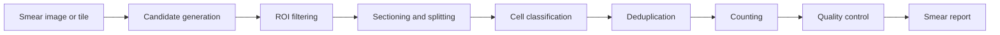

# ROI Detection, Sectioning & Counting Deep Dive

## Purpose
This document describes the core analytical bridge from smear image to cell count.

It covers:
- ROI candidate generation
- cell sectioning and splitting
- de-duplication across tiles
- parasitized cell counting
- count quality control
- smear-level reporting

---

## 1. Why this module is critical

The project becomes clinically useful only when it can move from a picture to an interpretable count.

That requires:
1. finding likely cell regions
2. splitting them into countable units
3. classifying each unit
4. removing duplicates
5. producing a final count and parasitemia estimate

---

## 2. System pipeline

---

## 3. Candidate generation

The first job is to find where cells probably are.

### Methods
- classical thresholding
- blob detection
- sliding window tile scoring
- learned object detection

### Outputs
- bounding boxes
- confidence scores
- tile density scores
- reject/keep decisions

### Design goal
Keep candidate generation broad enough to maintain recall, then filter later.

---

## 4. ROI filtering

Once candidates are generated, remove obvious false positives.

### Common filters
- too small to be a cell
- too large to be a single cell
- edge artifacts
- blank background
- low-confidence detections

### Filtering principle
Prefer high recall early, then sharpen precision in later stages.

---

## 5. Sectioning and splitting

Sectioning means converting a candidate region into analyzable units.

### Thin smear sectioning
- crop tightly around a cell
- classify the crop directly
- use minimal overlap to preserve uniqueness

### Thick smear sectioning
- tile into overlapping windows
- use segmentation or watershed-style splitting
- isolate subregions when cells touch

### Sectioning outputs
- individual cell crops
- cell clusters
- uncertain fragments

---

## 6. De-duplication

Duplicate counting is one of the biggest practical failure modes.

### Why duplicates happen
- overlapping tiles
- repeated detections from different scales
- segmentation fragments of the same cell

### Dedup strategies
- non-max suppression
- centroid clustering
- IoU-based merging
- confidence-weighted selection

### Dedup rule of thumb
Only one final count should survive per physical cell.

---

## 7. Classification layer

Each candidate cell or section should receive one of the following outputs:
- parasitized
- uninfected
- uncertain

### Good classifier behavior
- high confidence on obvious cells
- uncertainty on ambiguous crops
- calibrated probabilities, not just hard labels

### Recommended training setup
- weighted binary or multi-state classification
- soft labels for synthetic mixtures
- threshold calibration on validation data

---

## 8. Counting logic

### Primary counts
- total accepted cells
- parasitized cells
- uninfected cells
- uncertain cells

### Parasitemia formula
$$
\text{parasitemia} = \frac{\text{parasitized cells}}{\text{accepted total cells}} \times 100
$$

### What counts as accepted total cells
Accepted total cells should exclude:
- obvious background
- rejected fragments
- low-quality ambiguous regions if the QC policy says so

---

## 9. Quality control

### Count should be flagged if:
- detection coverage is too low
- duplicate rate is too high
- uncertainty rate is high
- the smear is out of focus
- the tile count is inconsistent with image size

### QC outputs
- good
- review
- reject

### Why QC matters
A count without quality context can be misleading. A robust system should know when not to trust itself.

---

## 10. Evaluation protocol

Counting should be evaluated at the smear level.

### Metrics
- absolute count error
- mean absolute error
- parasitemia percentage error
- recall for parasitized cells
- precision for accepted ROIs
- duplicate rejection rate

### Validation design
- compare against manual counts
- compare against manual ROI annotations
- keep source groups isolated across splits

---

## 11. Annotation schema

A useful annotation schema should support the counting pipeline.

### Minimum labels
- ROI bounding box
- ROI type: cell / cluster / background / uncertain
- cell label: parasitized / uninfected / ambiguous
- source group ID
- quality tag

### Optional labels
- bounding box confidence
- segmentation mask
- boundary uncertainty
- review status

---

## 12. Implementation guidance

### Suggested first version
1. generate candidate boxes with a simple detector or tile scorer
2. apply a crop-level classifier
3. de-duplicate overlapping detections
4. count accepted detections
5. compute parasitemia
6. flag low-quality smears for review

### Suggested later version
- add segmentation for thick smears
- add confidence calibration
- add source-aware duplicate tracking
- add smear-level uncertainty intervals

---

## 13. Repo integration points

Current files that feed into this:
- [train.py](../../train.py)
- [data/data_loader.py](../../data/data_loader.py)
- [data/synthetic_data_loader.py](../../data/synthetic_data_loader.py)
- [models/model_factory.py](../../models/model_factory.py)

Future modules to add:
- `analysis/roi_detector.py`
- `analysis/sectioning.py`
- `analysis/counting.py`
- `analysis/qc.py`

---

## 14. Immediate next steps

1. define the ROI label taxonomy
2. create a baseline candidate generator
3. implement de-duplication rules
4. add a smear-level count report format
5. build an evaluation table for manual comparison

---

## 15. Bottom line

This module is where the project becomes operationally useful. It turns detections into a final clinical-style count, and it must be conservative, traceable, and QC-aware.
