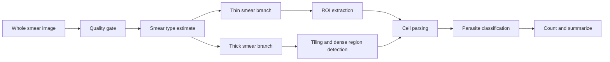

# Smear Analysis Deep Dive

## Purpose
This document explains how M.A.L.L.I. should analyze thick and thin blood smears as distinct but related image-analysis problems.

It focuses on the bridge from whole-image smear input to interpretable regions and cell-level outputs.

---

## 1. Why smear analysis needs its own design

A smear is not just a single cell image.
It is a scene with structure, density, overlap, blur, stain variation, and capture artifacts.

That means the pipeline must answer:
- is this thin or thick smear?
- where are the analyzable regions?
- how dense is the field?
- which regions contain cells?
- where do cells overlap or touch?
- which regions should be excluded from counting?

---

## 2. Thin smear and thick smear differ operationally

### Thin smear
- cells are more separated
- boundaries are easier to detect
- individual cell classification works well
- count estimates are more direct

### Thick smear
- cells overlap heavily
- density can be high
- segmentation and tiling matter more
- counts often need stronger de-duplication and confidence handling

### Practical consequence
Use separate analysis branches. Do not force one pipeline to handle both equally at the beginning.

---

## 3. Smear analysis pipeline

---

## 4. Quality gate before analysis

The image should be rejected or flagged if it is:
- too blurry
- too dark or too bright
- out of focus
- heavily occluded
- badly cropped

### Useful gate outputs
- pass
- warn
- reject

### Why this matters
A poor smear image can destroy both cell detection and count accuracy. It is cheaper to reject bad input than to miscount confidently.

---

## 5. Smear type estimation

The system should estimate whether the image behaves more like a thin or thick smear.

### Possible heuristics
- average cell density
- cell overlap ratio
- region compactness
- texture complexity
- number of cells per tile

### Initial implementation
Start with a simple rule-based or lightweight classifier that assigns:
- thin
- thick
- mixed
- uncertain

---

## 6. Thin smear analysis

Thin smears are the easier end of the spectrum.

### Goal
Isolate one cell per region whenever possible.

### Typical steps
1. detect candidate cell regions
2. crop ROIs
3. classify each cell
4. remove duplicates
5. count total and parasitized cells

### Thin-smear edge cases
- two cells touch lightly
- stain artifacts look like cells
- debris or dust creates false positives

### Recommended model direction
- lightweight detector or tile scorer
- direct cell classifier on crops
- confidence thresholding to flag uncertain regions

---

## 7. Thick smear analysis

Thick smears are more difficult because the scene is dense and partially ambiguous.

### Goal
Identify countable units without overclaiming exact boundaries when they are not available.

### Typical steps
1. tile the smear into overlapping windows
2. score tiles for cell density
3. locate dense clusters
4. attempt split or segmentation
5. classify derived cell units
6. merge duplicates across tile boundaries

### Thick-smear output philosophy
If exact cell boundaries are uncertain, the system should preserve the uncertainty instead of pretending to be exact.

---

## 8. Candidate analysis methods

### Classical methods
- thresholding
- morphology cleanup
- contour detection
- watershed separation
- connected component analysis

### Learned methods
- object detection
- semantic segmentation
- instance segmentation
- tile classification

### Recommended hybrid approach
Start with classical methods for speed and interpretability, then move to learned methods when annotation quality is sufficient.

---

## 9. Cell ROI semantics

A ROI should have a clear role.

Possible ROI types:
- single cell
- touching-cell cluster
- parasite-rich patch
- uncertain patch
- background exclusion zone

Each ROI should retain a link back to the source smear and the source tile.

---

## 10. What to exclude

Not every region should be counted.

Exclude or downweight:
- air bubbles
- extreme blur
- staining seams
- tissue debris
- microscope edge artifacts
- annotation noise

This can be handled with explicit exclusion labels or a QC stage.

---

## 11. Smear-specific outputs

The output for each smear should include:
- smear type
- quality score
- number of candidate ROIs
- number of accepted cell ROIs
- parasitized count
- uninfected count
- uncertain count
- parasitemia percentage
- QC flags

---

## 12. Research-backed implementation direction

A practical sequence is:
1. build a reliable thin-smear baseline
2. validate ROI localization
3. add dense-smear tiling
4. add segmentation only where needed
5. unify the reporting interface

That sequence keeps the project from becoming too hard too early.

---

## 13. Metrics to track

### ROI metrics
- detection precision
- detection recall
- mean IoU

### Smear metrics
- count error
- parasitemia percentage error
- false ROI rate
- uncertain ROI rate

### Operational metrics
- time per smear
- tiles per smear
- memory usage during analysis

---

## 14. Integration points

Relevant current files:
- [train.py](../../train.py)
- [data/data_loader.py](../../data/data_loader.py)
- [data/synthetic_data_loader.py](../../data/synthetic_data_loader.py)

Future modules to add:
- `analysis/smear_type.py`
- `analysis/roi_detection.py`
- `analysis/tiling.py`
- `analysis/aggregation.py`

---

## 15. Immediate next steps

1. define smear type labels and review criteria
2. create a thin-smear candidate ROI baseline
3. add a thick-smear tiling prototype
4. test count stability across overlapping windows
5. document ambiguity rules for uncertain regions

---

## 16. Bottom line

Smear analysis is the central scene-understanding problem in this project. The system should not merely classify a crop; it should understand the smear as a structured field of cells, clusters, and uncertainty.
